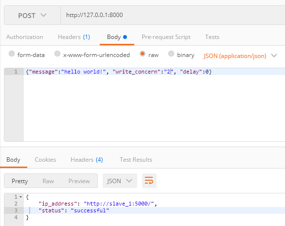
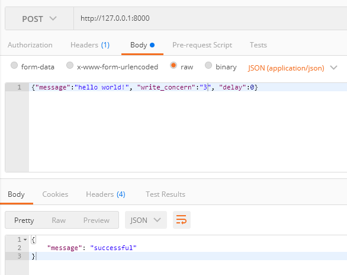

# Distributed Systems: Phase 2
1. Close repo with the `git clone https://github.com/eroyzman/Distributed-Systems.git`
2. Go to Iteration2 repo `cd Iteration2`
3. Write `docker-compose up --build`
4. Use some tool ([httpie](https://httpie.io/cli), curl, [httpx](https://www.python-httpx.org/), [Postman](https://www.postman.com/product/what-is-postman)) to make http request to the master node

post with w=1 (response from Master with no ACK from Secondary)

post with w=2 (response from Master and first available Secondary)

post with w=2 (response from Master and all Secondaries)

